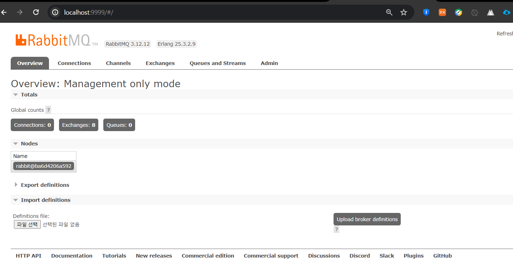

# Docker 로 RabbitMq 설치하기 

## 1. docker 시작  
  
## 2. rabbitmq 이미지 다운로드 
```bash
docker pull rabbitmq
```
  
## 3. rabbimq 컨테이너 설정 
```bash
docker run -d -p 9999:15672 -p 9997:5672 --name rabbitmq rabbitmq
```
> 외부 포트를 9999, 9997 로 설정하고 컨테이너 이름을 rabbitmq 로 함 

## 4. rabbitmq plugin 설치 
```bash
docker exec rabbitmq rabbitmq-plugins enable rabbitmq_management
```
  

## 5. rabbitmq 관리자 페이지 접속 

